# Fluxograma Codex

Este arquivo espelha a `spec_codex.md` em formato visual.

Os diagramas abaixo usam Mermaid.

## 1. Visao geral do sistema

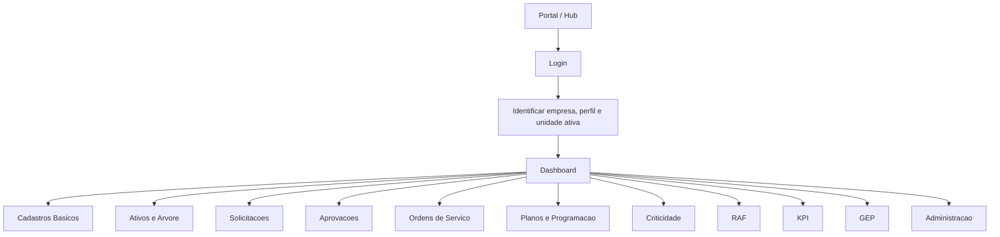

## 2. Fluxo de acesso e navegacao

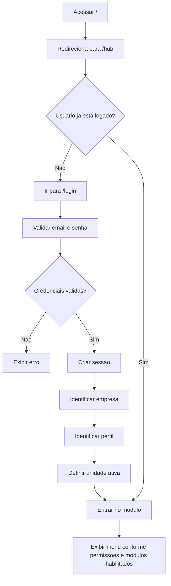

## 3. Fluxo operacional principal

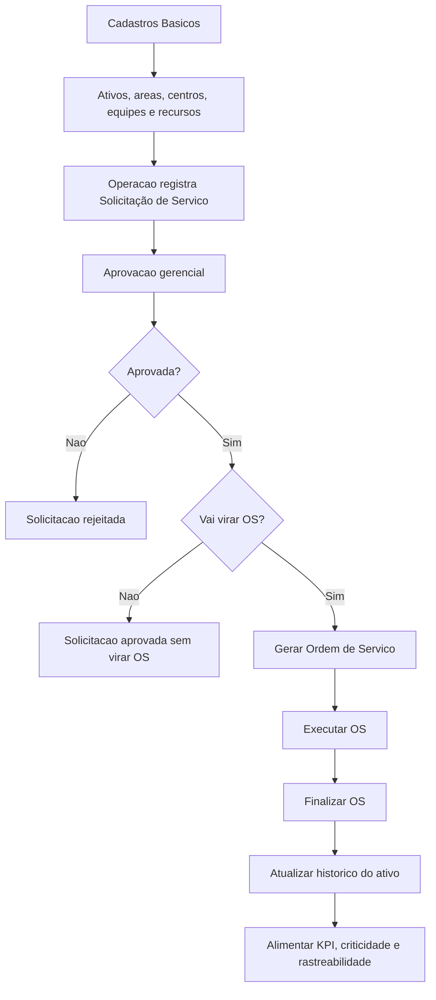

## 4. Fluxo de solicitacoes e aprovacoes

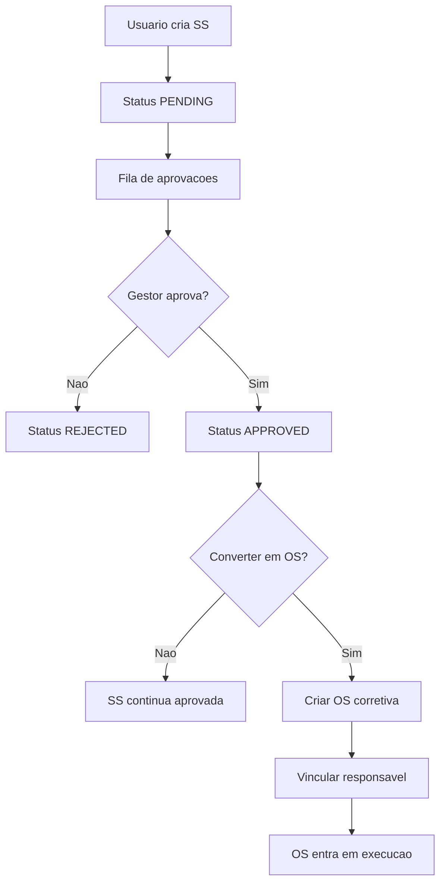

## 5. Fluxo de ordem de servico

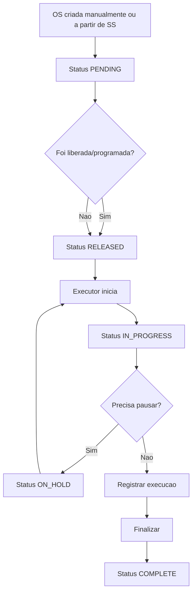

## 6. Fluxo de planejamento preventivo

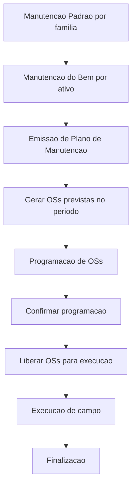

## 7. Fluxo automatico de preventivas

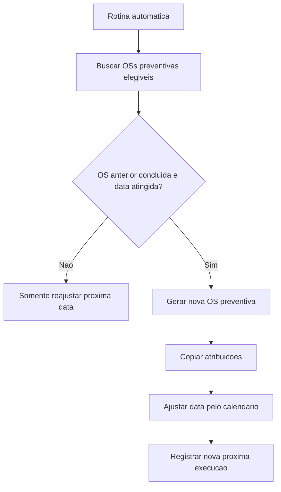

## 8. Fluxo de ativos, arvore e criticidade

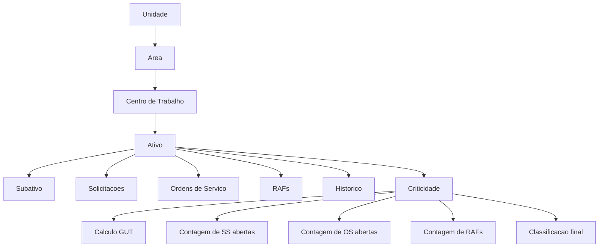

## 9. Fluxo de pessoas, equipes e unidades

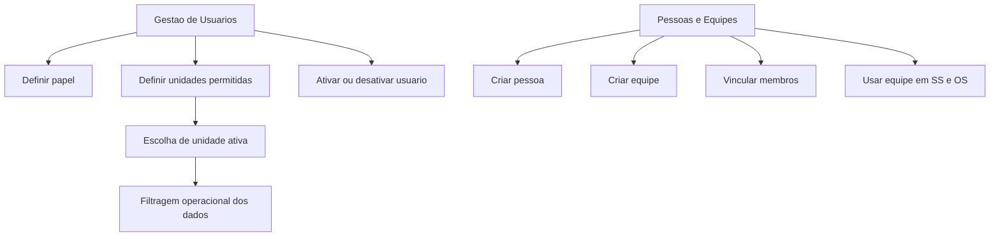

## 10. Fluxo de administracao do portal

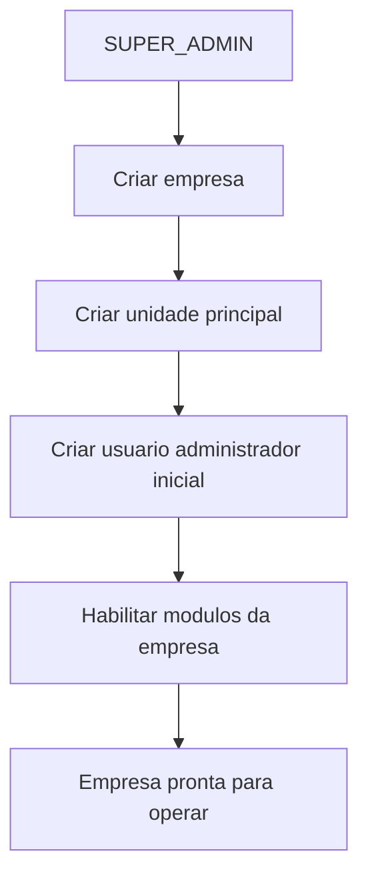

## 11. Fluxo de RAF

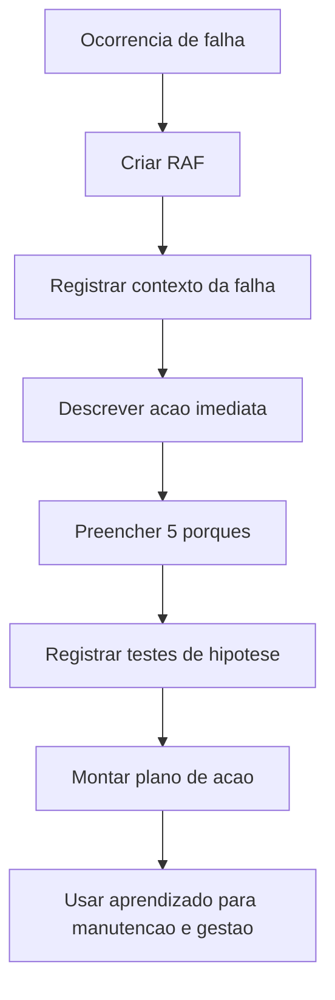

## 12. Fluxo de KPI e GEP

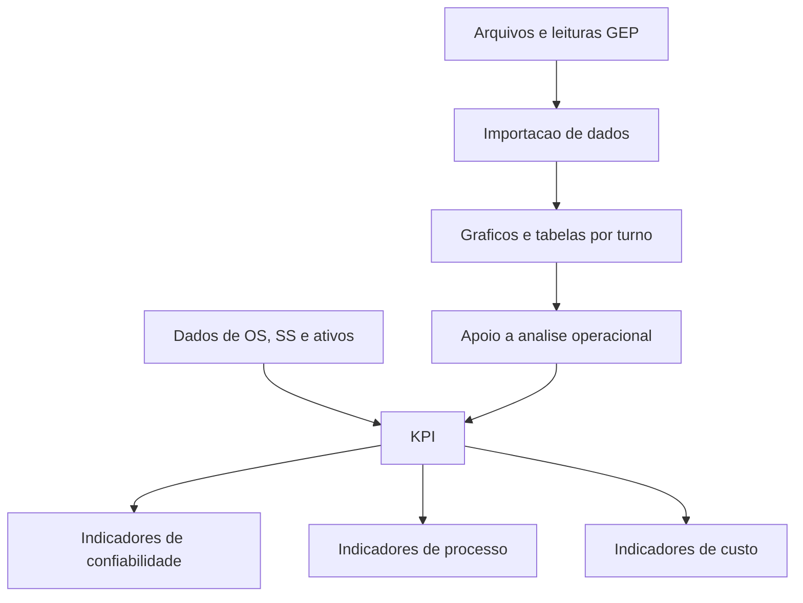

